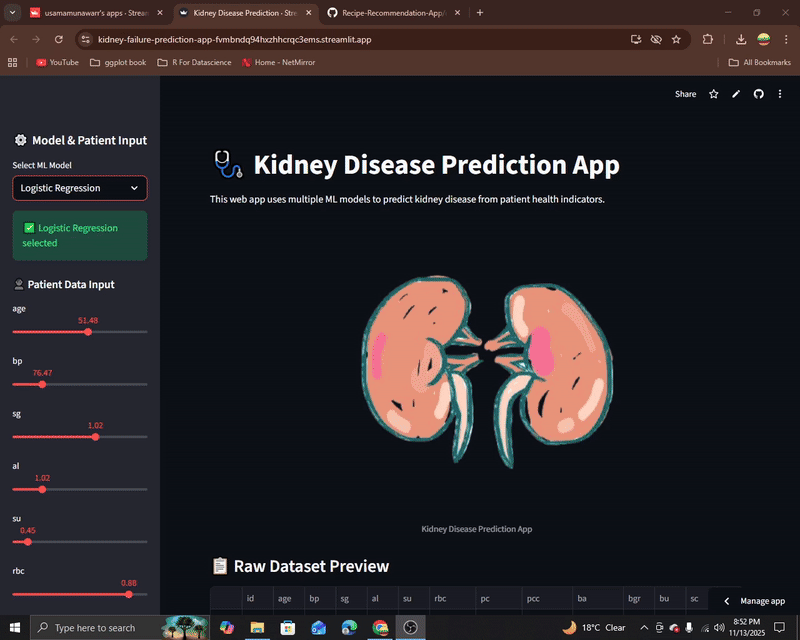

<h1 align="center">🩺 Kidney Disease Prediction App</h1>

## 🎥 Demo

Here’s a quick look at the system in action 👇

*A preview of the Mobile Price Predictor app.*
  

  

  A Streamlit-based web application that predicts **chronic kidney disease (CKD)** using multiple machine learning models.  
  It provides a clean, interactive interface for exploring patient health indicators and obtaining instant predictions.

---

## 🧠 Tech Stack & Tools

  

  
  

  

---

## ⚙️ Project Overview

The **Kidney Disease Prediction App** helps healthcare professionals and users to quickly predict CKD risk based on patient health metrics.
The app implements **multiple machine learning models** and visualizes data trends to provide insights into the dataset.

---

## ✨ Features

✅ User-friendly Streamlit interface
✅ Multiple ML models available for predictions: Logistic Regression, Decision Tree, Random Forest, Gradient Boosting, K-Nearest Neighbors
✅ Patient data input via interactive sliders
✅ Real-time predictions with visual feedback
✅ Data visualization including correlation heatmaps and class distributions
✅ Responsive design with sidebar controls for model selection and input

---

## 🧩 Models Included

| Model               | Description                                    |
| ------------------- | ---------------------------------------------- |
| Logistic Regression | Linear classifier for binary outcomes          |
| Decision Tree       | Rule-based classification method               |
| Random Forest       | Ensemble of decision trees for better accuracy |
| Gradient Boosting   | Sequential ensemble learning technique         |
| K-Nearest Neighbors | Classifies based on proximity to training data |

---

## 🧪 Input Parameters

The app uses all dataset columns (except the target) as input features.
Users can adjust patient values interactively in the sidebar using sliders.
Example features include:

* Age, Blood Pressure, Specific Gravity, Albumin
* Sugar levels, Blood Urea, Serum Creatinine
* Sodium, Potassium, Hemoglobin, Packed Cell Volume, WBC count, RBC count, etc.

---

## 🚀 How to Use

1. Clone the repository:
   `git clone https://github.com/UsamaMunawarr/Kidney-Disease-Prediction-App.git`
2. Navigate into the project folder:
   `cd Kidney-Disease-Prediction-App`
3. Install required dependencies:
   `pip install -r requirements.txt`
4. Run the Streamlit app:
   `streamlit run app.py`
5. The app will open in your default browser.
   Select a model → Input patient data → Click **Predict Kidney Disease**.

---

## 📊 Visualizations

* Correlation heatmap for numeric features
* CKD vs Non-CKD class distribution
* Model accuracy comparison with bar chart

*(Add screenshots or GIF here to showcase visualizations)*

---

## 💬 Author

**Usama Munawar**
📍 Data Science & Machine Learning Enthusiast
💡 Passionate about building AI-powered healthcare solutions

### 🌐 Connect with Me

  
  
  
  
  

---

## 💚 Acknowledgements

This project demonstrates how machine learning can be applied for **early-stage CKD detection**, promoting **preventive healthcare** and awareness.

---

> 🩺 *"Early detection saves lives — use data science to empower health decisions."*
